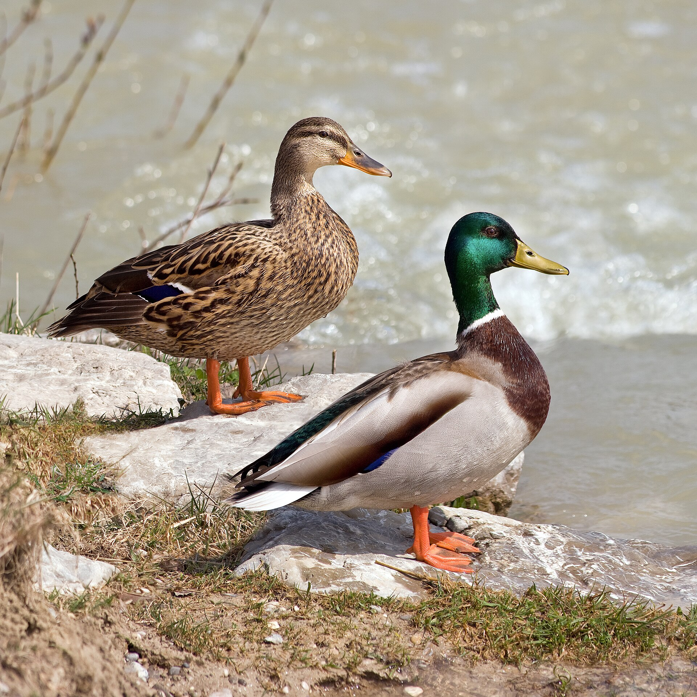

Mallard ducks (*Anas platyrhynchos*) are adaptable dabbling ducks found across much of the Northern Hemisphere. They use a wide range of wetland habitats and can travel between feeding, resting, and breeding sites as conditions change.

Lake Constance is a large lake in central Europe bordered by Germany, Switzerland, and Austria. GPS tracking reveals how individual mallards move through this region, including the geographic extent of their movements, differences in tracking effort, and seasonal patterns in their speed and locations.

<div style="display: flex; justify-content: center;">
  
</div>

```{r}
#| message: false
library(tidyverse)
library(sf)
```

```{r}
#| cache: true
mallards <- readRDS("data/mallards.rds")
```

```{r}
mallards |>
  count(duck_id, name = "gps_fixes", sort = TRUE)
```

```{r}
mallards |>
  summarise(
    min_latitude = min(lat, na.rm = TRUE),
    max_latitude = max(lat, na.rm = TRUE),
    min_longitude = min(long, na.rm = TRUE),
    max_longitude = max(long, na.rm = TRUE)
  )
```
